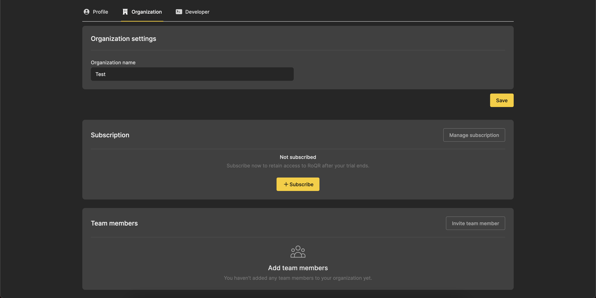

+++
title = "Inviting a team member"
description = "Styles let you re-use the visual design of your QR codes."
date = 2021-05-01T08:00:00+00:00
updated = 2021-05-01T08:00:00+00:00
draft = false
weight = 11
sort_by = "weight"
template = "docs/page.html"

[extra]
toc = false
top = false
+++

RoQR is built for your whole team, and there are no restrictions on the number of team members you can invite to your organization.

## Inviting a team member

Navigate to the [organization settings page](https://roqr.app/settings/organization) by clicking your profile picture at the top of the page, clicking the settings field and finally the organization header.

Next, click the `Invite team member` button to navigate to the [invitation page](http://roqr.app/users/invitation/new).

Fill out the name and email of your team member, and assign them a role from the drop-down menu.

### Choosing which role to grant

Roles define what the team member will be allowed to do on the RoQR platform.

A `viewer` can view all the created links on the platform, download images of your QR codes, and see statistics about the scans of your codes. This role is suited for team members who need access to the QR codes and/or scan data, but who will not need to edit or create new codes.

An `editor` has all the permissions of a `viewer`, but can also create new styles and links. Any team member who will be involved in the design or creation of new QR codes needs at least `editor`-level permissions.

An `administrator` has full control of your organization's RoQR account. In addition to the permissions defined above, an `administrator` can also invite new team members, edit and delete existing team members and manage billing and subscription information.

Once you have filled out all the information for the team member, click the `Send invitation` button to invite the team member. We will notify you once the team member has accepted the invitation.

