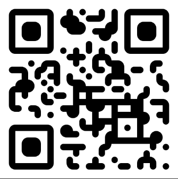
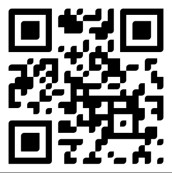
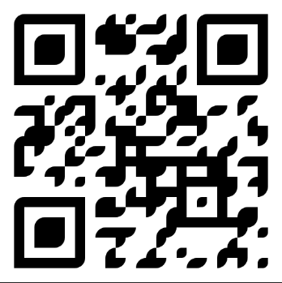
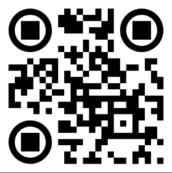
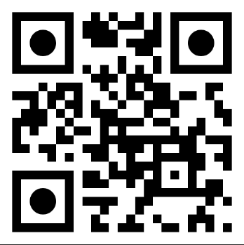

+++
title = "Style"
description = "Styles let you create reusable visual designs for your QR codes."
date = 2021-05-01T08:00:00+00:00
updated = 2021-05-01T08:00:00+00:00
draft = false
weight = 20
sort_by = "weight"
template = "docs/page.html"

[extra]
toc = true
top = false
+++

Styles let you create reusable visual designs for your QR codes.

## Style attributes

<dl>
    <dt>Name</dt>
    <dd>A unique name to identify the style. This name is used when selecting which style to apply to a link.</dd>
    <dt>Background color</dt>
    <dd>The color to apply to the background of the QR code.</dd>
    <dt>Dots color</dt>
    <dd>The color to apply to all the "dots" in the QR code. By default, this color will also apply to the corner squares and corner dots color.</dd>
    <dt>Dots shape</dt>
    <dd>The shape to apply to the "dots" in the QR code. For a list of possible shapes, see the Shapes section.</dd>
    <dt>Corner squares color</dt>
    <dd>The color to apply to the corner squares in the QR code.</dd>
    <dt>Corner squares shape</dt>
    <dd>The shape to apply to the corner squares in the QR code. For a list of possible shapes, see the Shapes section.</dd>
    <dt>Corner dots color</dt>
    <dd>The color to apply to the corner "dots" in the QR code.</dd>
    <dt>Corner dots shape</dt>
    <dd>The shape to apply to the corner "dots" in the QR code. For a list of possible shapes, see the Shapes section.</dd>
    <dt>Image URL</dt>
    <dd>The URL of an image to put in the center of the QR code.</dd>
</dl>

## Dots shapes

### Square

### Rounded

### Extra-rounded

### Dots

### Classy

### Classy-rounded

## Corner squares shapes

### Square

### Extra-rounded

### Dots

## Corner dots shapes

### Square

### Rounded

